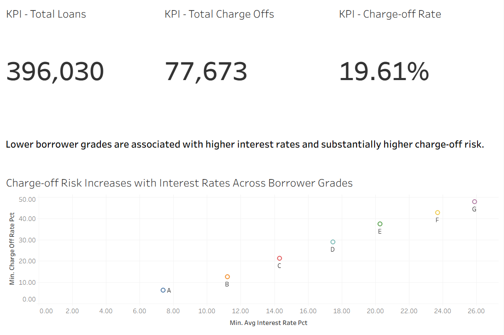

# Credit Risk Analysis (LendingClub)

## 1. Executive Summary

This project analyzes credit risk patterns in LendingClub loan data with a focus on borrower grades, interest rates, and charge-off behavior. Using Tableau dashboards built on a cleaned analytical dataset, the analysis shows a clear risk–pricing relationship: lower borrower grades carry higher interest rates and materially higher charge-off risk. These insights can support risk-based pricing, portfolio monitoring, and underwriting policy decisions.

Key takeaway: Charge-off risk increases sharply from grades A–D and is most concentrated in grades E–G, where both interest rates and default risk peak.

## 2. Business Problem

Lenders must balance growth and profitability against default risk. Poor calibration between borrower risk and loan pricing can lead to excessive charge-offs or lost revenue opportunities. The business question addressed here is:

    How does borrower credit grade relate to interest rates and charge-off risk, and where is default risk most concentrated within the loan portfolio?

Answering this helps stakeholders understand whether higher-risk borrowers are being compensated appropriately through pricing and where risk concentration warrants closer monitoring.

## 3. Methodology 

1. Data preparation

    -Cleaned and aggregated LendingClub loan data into analytical tables by borrower grade.

    -Calculated key metrics including total loans, total charge-offs, charge-off rate, and average interest rate.

2. Exploratory analysis

    -Analyzed charge-off rates and interest rates across borrower grades.

    -Identified monotonic trends and risk concentration patterns.

3. Visualization (Tableau)

    -Built KPI tiles summarizing portfolio size and overall charge-off rate.

    -Created dashboards to visualize:

        Charge-off risk by borrower grade

        Relationship between interest rates and charge-off risk

## 4. Skills

-SQL / Data Analysis: aggregation, grouping, metric calculation

-Data Visualization: Tableau (dashboards, KPIs, scatter plots)

-Data Storytelling: translating risk metrics into business insights

-Version Control: Git/GitHub project structure and documentation

## 5. Results & Business Recommendations

Findings:

-Charge-off rates increase consistently as borrower grade worsens.

-Interest rates rise alongside risk, indicating risk-based pricing is present.

-Grades E–G account for the highest concentration of default risk.

Recommendations:

-Apply tighter underwriting or additional verification for grades E–G.

-Monitor exposure limits by grade to prevent over-concentration in high-risk segments.

-Use these dashboards for ongoing portfolio monitoring and pricing reviews.

## 6. Dashboards

### Credit Risk Overview

Description: This dashboard provides a high-level summary of LendingClub’s loan portfolio, focusing on overall exposure and credit performance. Key KPIs display total loans issued, total charge-offs, and the overall charge-off rate, allowing stakeholders to quickly assess portfolio health at a glance.

The scatter plot visualizes the relationship between average interest rates and charge-off risk across borrower grades. As borrower grade worsens, both interest rates and charge-off rates increase, highlighting the presence of risk-based pricing and reinforcing that higher-risk borrowers are associated with materially higher default risk.

### Risk Concentration by Borrower Grade

Description: This dashboard focuses on how credit risk is distributed across borrower grades. The bar chart shows average charge-off rates by grade, clearly illustrating a monotonic increase in default risk from Grade A through Grade G.

The visualization highlights that the highest concentration of charge-off risk occurs in lower borrower grades (E–G), where default rates peak. This insight is critical for identifying risk concentration within the portfolio and supports tighter underwriting, monitoring, or exposure limits for high-risk segments.

## 7. Tableau Public Link

https://public.tableau.com/app/profile/nathanon.chaiyapan/viz/credit-risk-analysis/CreditRiskOverviewDashboard

## 8. Next Steps

-Extend analysis to loan term, purpose, and borrower income segments.

-Add time-based analysis to track how risk evolves across vintages.

-Incorporate predictive modeling to estimate expected loss by grade.
